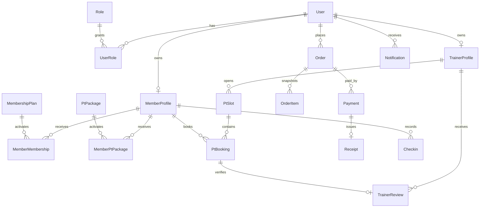

# Thiết kế cơ sở dữ liệu

Schema chính thức tại `backend/prisma/schema.prisma`, migration tại `backend/prisma/migrations/`.

## 20 bảng lõi

1. `users`, `roles`, `user_roles`
2. `email_verification_tokens`
3. `member_profiles`, `trainer_profiles`
4. `membership_plans`, `member_memberships`
5. `pt_packages`, `member_pt_packages`
6. `pt_slots`, `pt_bookings`, `trainer_reviews`
7. `checkins`
8. `orders`, `order_items`
9. `payments`, `receipts`
10. `notifications`, `audit_logs`

## Ràng buộc đáng chú ý

- UUID làm khóa chính; email, mã Member/PT, order/payment/receipt và idempotency key là unique.
- `Decimal(12,2)` cho tiền; snapshot sản phẩm nằm ở `order_items`.
- `MemberPtPackage.sessionsReserved` giữ số buổi của booking PENDING/CONFIRMED; `sessionsUsed` chỉ tăng khi COMPLETED/NO_SHOW.
- `PtBooking.holdKey` unique khi PENDING/CONFIRMED, trả về null lúc REJECTED/CANCELLED/COMPLETED/NO_SHOW.
- `TrainerReview.bookingId` unique và rating có check 1–5; mỗi booking hoàn thành chỉ có một đánh giá.
- Payment lưu `requestedAt`, `expiresAt`, `confirmedAt`, `confirmedById`, thời điểm/lý do từ chối; Receipt chỉ gắn Payment PAID.
- Quan hệ tài chính không cascade delete; OrderItem cascade theo Order, role/token cascade theo User.
- Index cho email token, membership, booking, check-in, order, payment và audit lookup.

## Quan hệ khái niệm

