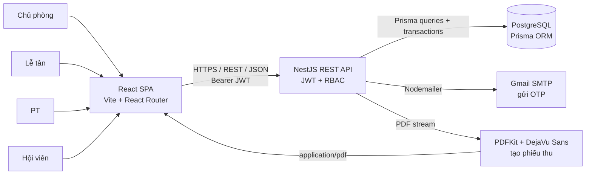
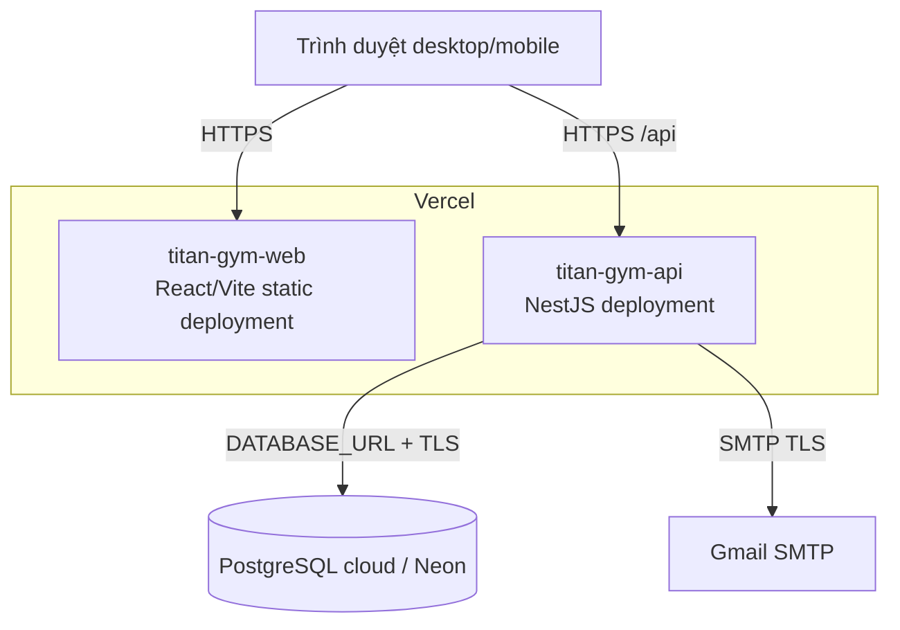
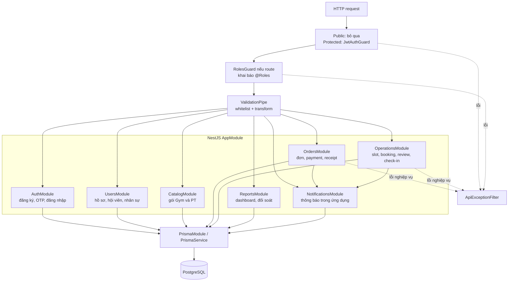
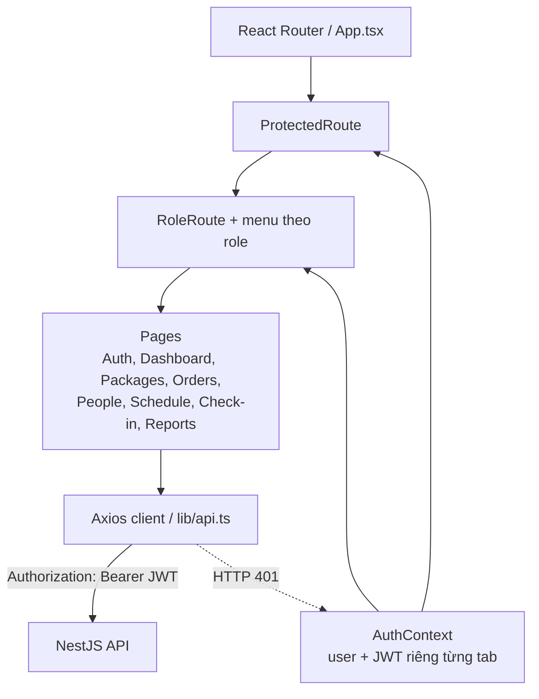

# Kiến trúc hệ thống

Tài liệu này mô tả kiến trúc đang được triển khai trong mã nguồn. Backend là một **modular monolith**, không phải hệ microservice; Frontend và Backend được deploy thành hai Vercel Project độc lập nhưng dùng chung một PostgreSQL production.

## 1. System context

Trình duyệt không kết nối trực tiếp PostgreSQL hoặc SMTP. QR chứa mã Hội viên; việc đọc QR diễn ra tại trình duyệt của Lễ tân/Chủ phòng, sau đó Frontend gọi API để kiểm tra và ghi nhận check-in.

## 2. Cấu trúc container khi deploy

- Frontend production: `https://titan-gym-web.vercel.app`.
- Backend production: `https://titan-gym-api.vercel.app/api`.
- Swagger: `https://titan-gym-api.vercel.app/api/docs`.
- Local dùng React `:5173`, NestJS `:3000` và PostgreSQL 17 trong Docker ở `127.0.0.1:5432`.
- `FRONTEND_URL` là allow-list CORS của Backend; `VITE_API_URL` trỏ Frontend đến Backend.

## 3. Cấu trúc Backend

Mỗi module theo cấu trúc `Controller → Service → PrismaService`:

1. Controller nhận route/DTO và trả response envelope.
2. Route public bỏ qua JWT; route bảo vệ dùng `JwtAuthGuard`, và `RolesGuard` chỉ áp dụng khi controller/handler khai báo `@Roles`.
3. Sau guard, `ValidationPipe` loại field thừa, chuyển kiểu và kiểm tra DTO trước khi controller nhận body/query.
4. Orders và Operations còn kiểm tra role, ownership và chuyển trạng thái trong service vì quyền phụ thuộc bản ghi cụ thể.
5. Service thực hiện nghiệp vụ; các luồng payment, đặt/hủy/hoàn thành PT và check-in quan trọng chạy trong database transaction.
6. `ApiExceptionFilter` chuẩn hóa lỗi thành `success`, `errorCode` và `message`.

## 4. Cấu trúc Frontend

Ẩn menu và `RoleRoute` chỉ là lớp trải nghiệm người dùng. Backend mới là nguồn quyết định quyền cuối cùng. Phiên đăng nhập dùng `sessionStorage` để các tab có thể đăng nhập các vai trò độc lập. Các màn hình nghiệp vụ tự đồng bộ định kỳ và khi tab được mở lại; dự án hiện không dùng WebSocket.

## 5. Nguồn sự thật kỹ thuật

Khi tài liệu và mã nguồn khác nhau, đối chiếu theo thứ tự:

1. Database: `backend/prisma/schema.prisma` và `backend/prisma/migrations/`.
2. API/quyền/nghiệp vụ: controller, DTO và service trong `backend/src/modules/`.
3. Route và hành vi giao diện: `frontend/src/App.tsx` và `frontend/src/pages/`.
4. Sơ đồ luồng: `Sequences.md` và `Collaboration.md` trong cùng thư mục này.
