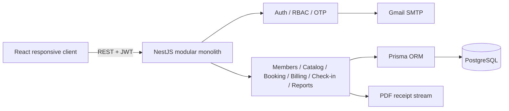

# Architecture

```mermaid
flowchart LR
  Browser[React responsive client] -->|REST + JWT| API[NestJS modular monolith]
  API --> Auth[Auth / RBAC / OTP]
  API --> Domain[Members / Catalog / Booking / Billing / Check-in / Reports]
  Auth --> SMTP[Gmail SMTP]
  Domain --> Prisma[Prisma ORM]
  Prisma --> DB[(PostgreSQL)]
  Domain --> PDF[PDF receipt stream]
```

Controller chỉ nhận request/DTO; service xử lý nghiệp vụ; Prisma/database là lớp nhất quán cuối. Frontend không tự thay đổi PAID, lượt PT, quyền lợi hay tổng thu.

