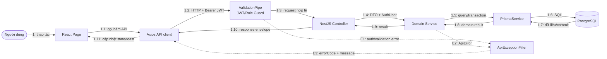
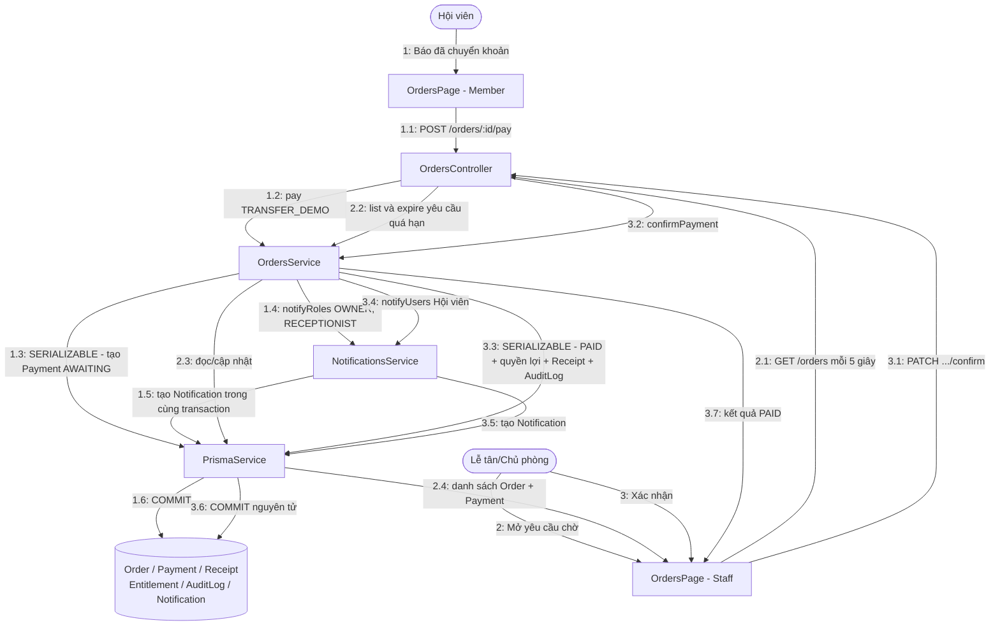
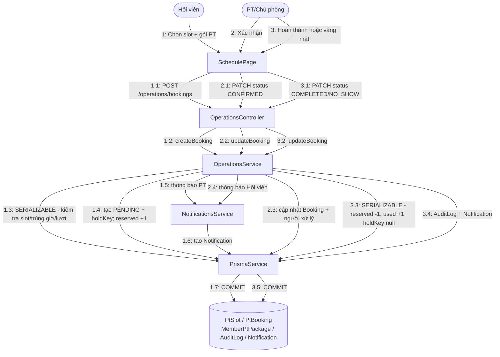
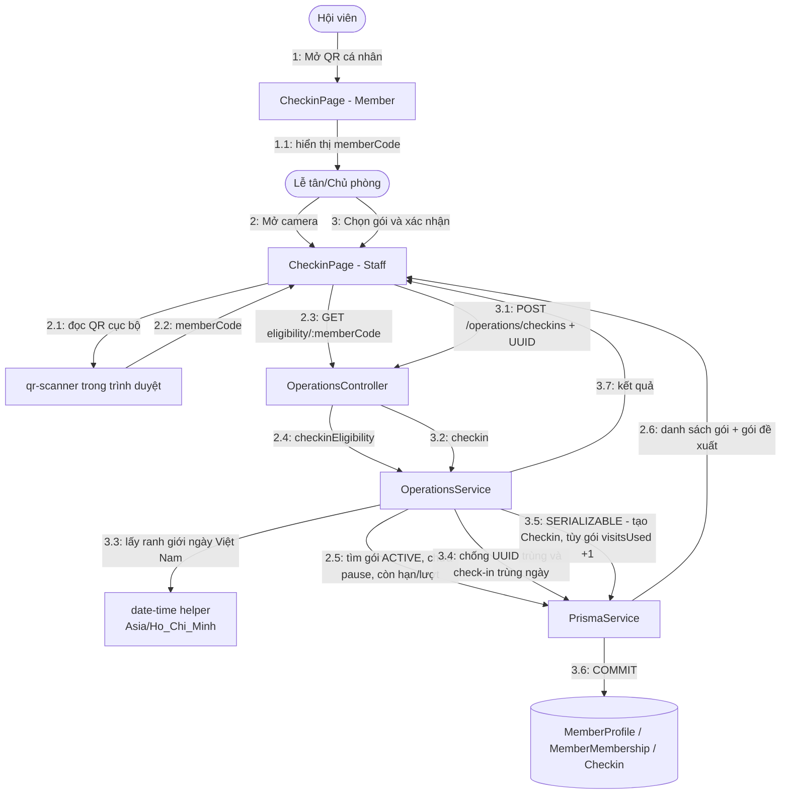
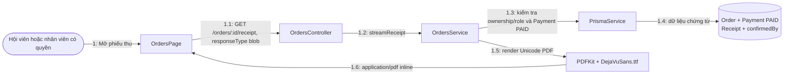

# Collaboration Diagram

Mermaid chưa có cú pháp UML Communication Diagram riêng. Các sơ đồ dưới đây dùng `flowchart` với đối tượng và thông điệp đánh số theo đúng cách đọc Collaboration/Communication Diagram: đọc `1`, `1.1`, `1.2`… để theo dõi thứ tự cộng tác.

## 1. Cộng tác tổng thể giữa các lớp

Frontend kiểm soát route/menu để hỗ trợ trải nghiệm. Guard và service của Backend mới thực thi bảo mật, ownership và quy tắc chuyển trạng thái.

## 2. Xác nhận chuyển khoản

`OrdersService` là nơi phối hợp nghiệp vụ; `NotificationsService` nhận cùng `Prisma.TransactionClient`, vì vậy thông báo xác nhận được ghi cùng transaction với Payment và quyền lợi.

## 3. Đặt lịch PT và giữ buổi

Nếu lịch bị `REJECTED` hoặc `CANCELLED`, cộng tác ở bước 3 đổi thành `sessionsReserved -= 1`, không tăng `sessionsUsed`, giải phóng `holdKey` và lưu lý do/người xử lý.

## 4. Check-in QR có nhân viên xác nhận

QR không tự cấp quyền vào phòng tập. Nhân viên luôn nhìn thấy kết quả eligibility, chọn gói áp dụng và gửi xác nhận. Nếu đã có check-in trong ngày, Backend trả `CHECKIN_ALREADY_TODAY`; hệ thống không tạo bản ghi hoặc trừ lượt lần hai, còn Lễ tân có thể cho Hội viên vào theo chính sách đã thống nhất.

## 5. Phiếu thu PDF

Luồng này chỉ đọc dữ liệu đã tồn tại. Việc mở lại PDF không tạo Receipt mới và không làm thay đổi doanh thu.
