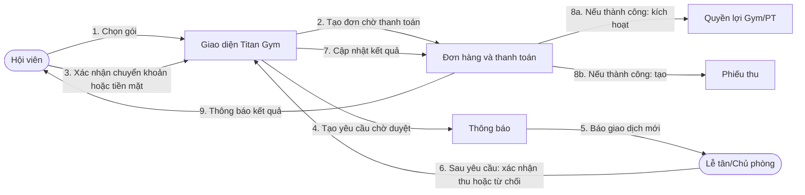
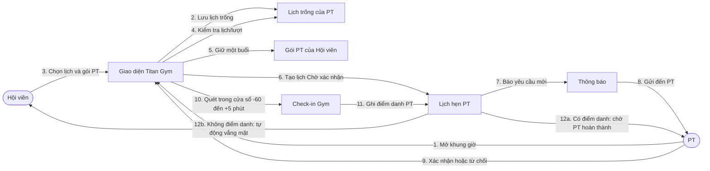
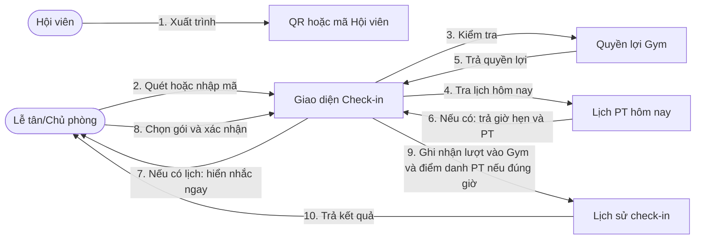
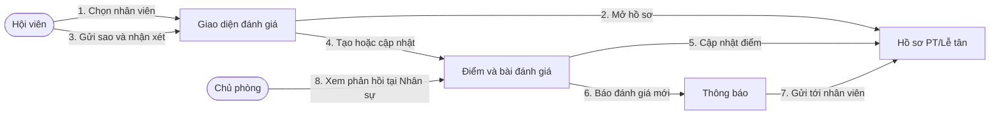
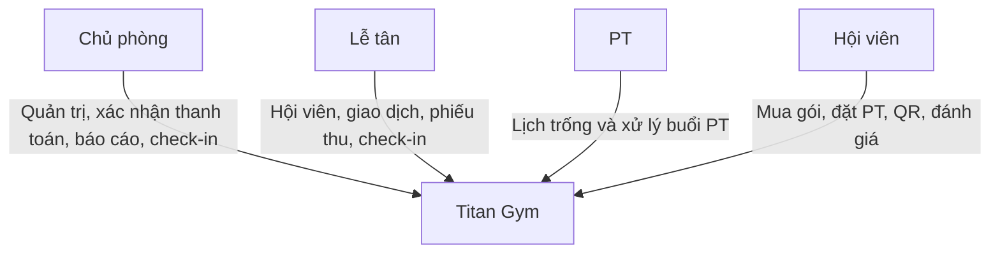

# Collaboration Diagram

Các sơ đồ cho biết những đối tượng nào phối hợp trong từng quy trình. Đọc thông điệp theo thứ tự `1`, `2`, `3`…; tên lớp kỹ thuật được thay bằng tên nghiệp vụ để dễ trình bày.

## 1. Mua gói và thanh toán

Cả chuyển khoản và tiền mặt đều đi từ bước 3. Khi Hội viên chưa xác nhận, nhân viên chỉ thấy trạng thái chờ và không thể chuyển đơn sang đã thanh toán.

## 2. Đặt lịch PT

Ngay khi hết giờ, buổi có điểm danh chuyển sang chờ PT xác nhận hoàn thành. Buổi chưa điểm danh được chờ thêm 5 phút; nếu vẫn không có điểm danh thì tự chuyển vắng mặt. Cả hoàn thành và vắng mặt đều chuyển buổi đang giữ thành đã dùng.
Chủ phòng có thể hỗ trợ xử lý lịch; chỉ PT mở khung giờ của chính mình.

## 3. Check-in QR

Nhắc lịch chỉ hiện khi Hội viên có lịch PT hoạt động trong ngày. Quét lại không tạo thêm lượt Gym nhưng vẫn ghi điểm danh PT nếu nằm trong cửa sổ hợp lệ; điểm danh không tự hoàn thành booking.

## 4. Đánh giá nhân viên

Không cần có lịch PT trước đó. Mỗi Hội viên chỉ có một bài cho mỗi nhân viên và được cập nhật bài của chính mình.

## 5. Vai trò trong hệ thống

Giao diện chỉ hiển thị chức năng theo vai trò; hệ thống vẫn kiểm tra quyền trước khi thực hiện nghiệp vụ.
