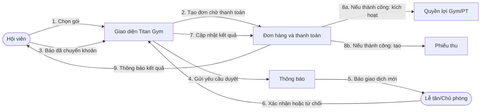
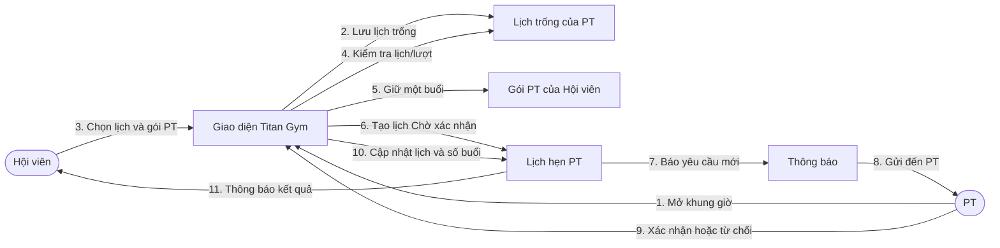
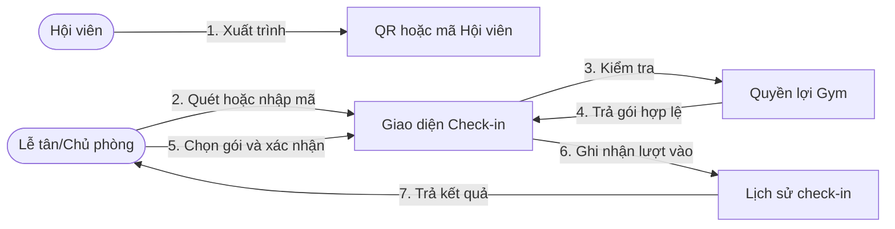
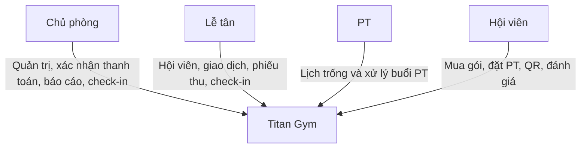

# Collaboration Diagram

Các sơ đồ cho biết những đối tượng nào phối hợp trong từng quy trình. Đọc thông điệp theo thứ tự `1`, `2`, `3`…; tên lớp kỹ thuật được thay bằng tên nghiệp vụ để dễ trình bày.

## 1. Mua gói và thanh toán

Với tiền mặt, quy trình bắt đầu từ bước 6: nhân viên xác nhận đã thu tiền, sau đó hệ thống kích hoạt quyền lợi và tạo phiếu thu.

## 2. Đặt lịch PT

Khi hoàn thành hoặc vắng mặt, buổi đang giữ chuyển thành đã dùng. Khi từ chối hoặc hủy hợp lệ, buổi đang giữ được hoàn lại.
Chủ phòng có thể hỗ trợ xử lý lịch; chỉ PT mở khung giờ của chính mình.

## 3. Check-in QR

Nếu Hội viên đã check-in trong ngày, lịch sử không tạo thêm bản ghi và không trừ thêm lượt; Lễ tân vẫn có thể cho Hội viên vào.

## 4. Vai trò trong hệ thống

Giao diện chỉ hiển thị chức năng theo vai trò; hệ thống vẫn kiểm tra quyền trước khi thực hiện nghiệp vụ.
