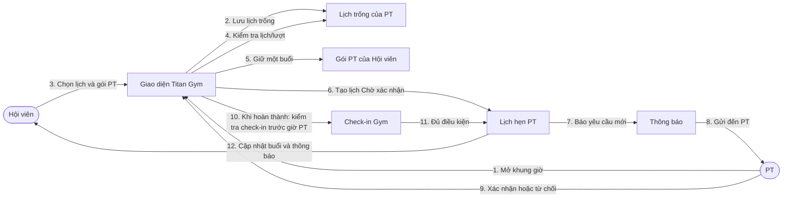
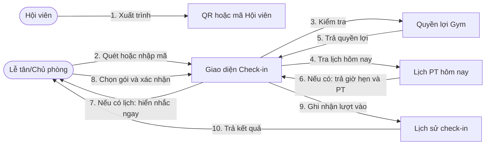
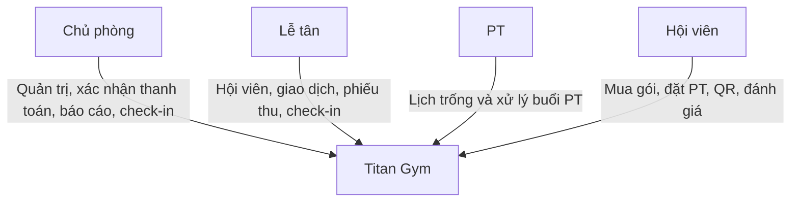

# Collaboration Diagram

Các sơ đồ cho biết những đối tượng nào phối hợp trong từng quy trình. Đọc thông điệp theo thứ tự `1`, `2`, `3`…; tên lớp kỹ thuật được thay bằng tên nghiệp vụ để dễ trình bày.

## 1. Mua gói và thanh toán

Với tiền mặt, quy trình bắt đầu từ bước 6: nhân viên xác nhận đã thu tiền, sau đó hệ thống kích hoạt quyền lợi và tạo phiếu thu.

## 2. Đặt lịch PT

Hoàn thành yêu cầu Hội viên check-in Gym cùng ngày và không muộn hơn giờ bắt đầu. Hoàn thành hoặc vắng mặt chuyển buổi đang giữ thành đã dùng; từ chối/hủy hợp lệ hoàn lại buổi.
Chủ phòng có thể hỗ trợ xử lý lịch; chỉ PT mở khung giờ của chính mình.

## 3. Check-in QR

Nhắc lịch chỉ hiện khi Hội viên có lịch PT hoạt động trong ngày. Quét lại không tạo thêm check-in; check-in không tự hoàn thành booking.

## 4. Đánh giá nhân viên

Không cần có lịch PT trước đó. Mỗi Hội viên chỉ có một bài cho mỗi nhân viên và được cập nhật bài của chính mình.

## 5. Vai trò trong hệ thống

Giao diện chỉ hiển thị chức năng theo vai trò; hệ thống vẫn kiểm tra quyền trước khi thực hiện nghiệp vụ.
