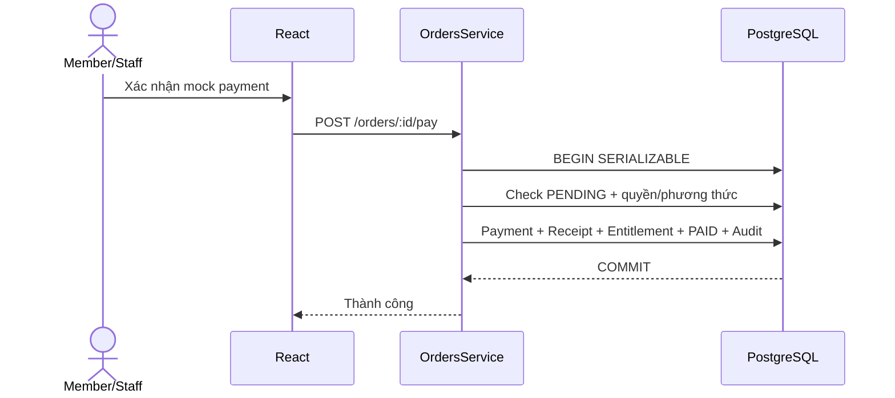
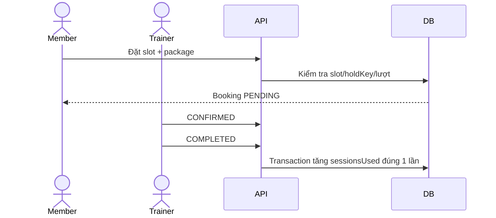

# Sequence Diagrams

## Mock payment

```mermaid
sequenceDiagram
  actor U as Member/Staff
  participant FE as React
  participant API as OrdersService
  participant DB as PostgreSQL
  U->>FE: Xác nhận mock payment
  FE->>API: POST /orders/:id/pay
  API->>DB: BEGIN SERIALIZABLE
  API->>DB: Check PENDING + quyền/phương thức
  API->>DB: Payment + Receipt + Entitlement + PAID + Audit
  DB-->>API: COMMIT
  API-->>FE: Thành công
```

## Booking PT

```mermaid
sequenceDiagram
  actor M as Member
  actor T as Trainer
  participant API
  participant DB
  M->>API: Đặt slot + package
  API->>DB: Kiểm tra slot/holdKey/lượt
  DB-->>M: Booking PENDING
  T->>API: CONFIRMED
  T->>API: COMPLETED
  API->>DB: Transaction tăng sessionsUsed đúng 1 lần
```

