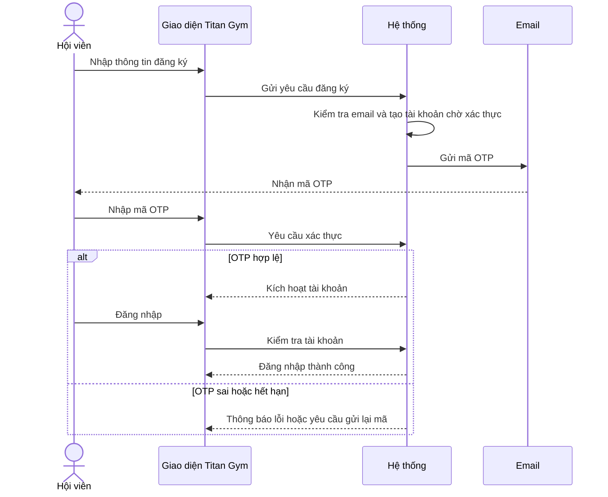
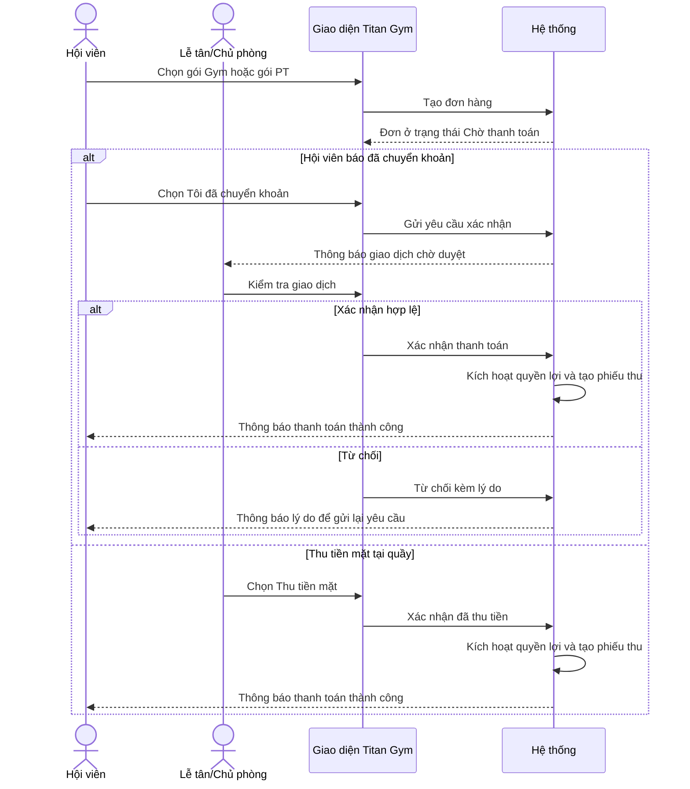
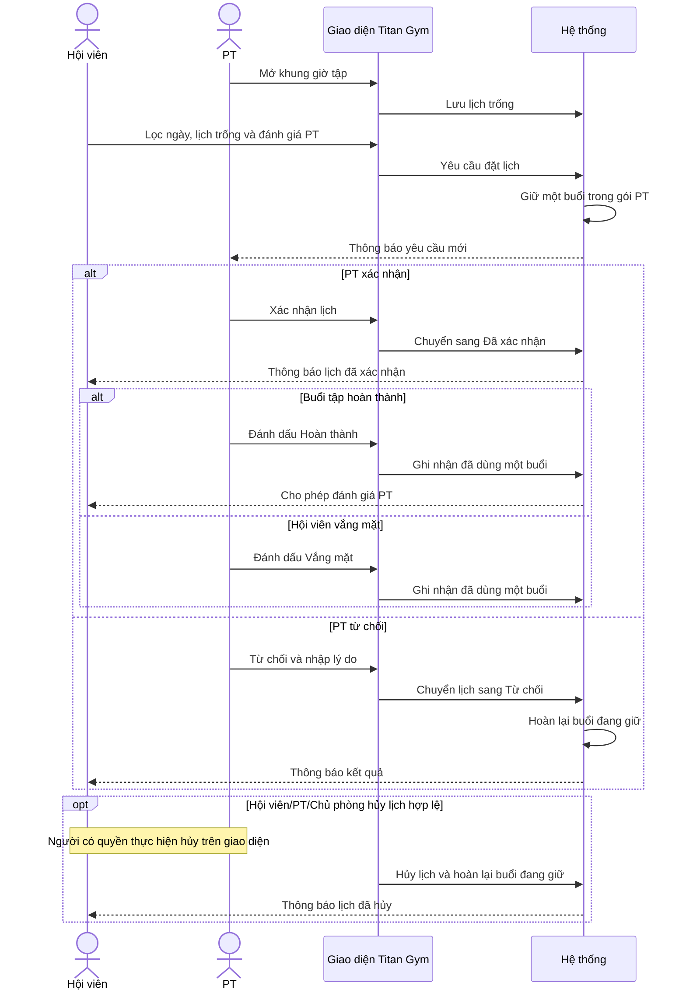
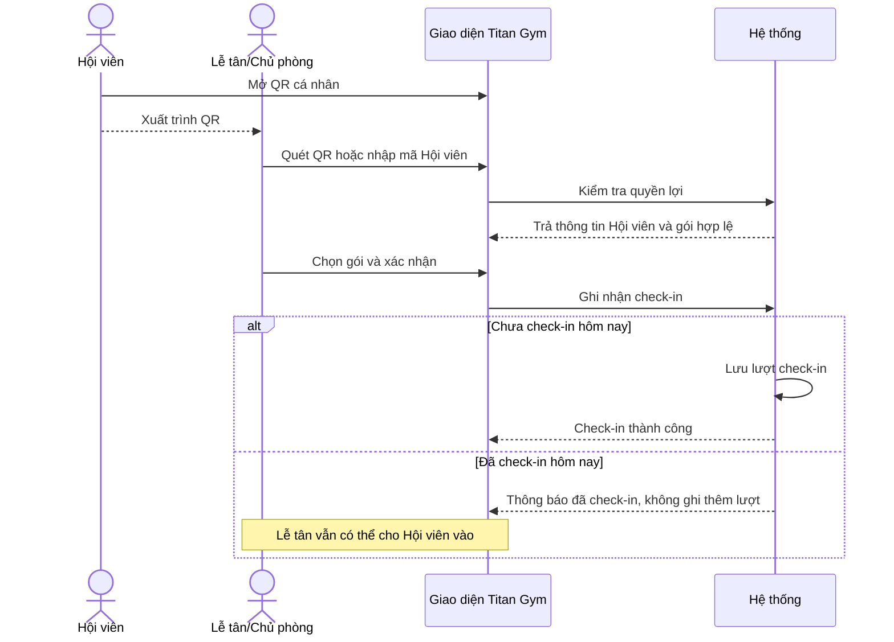

# Sequence Diagram

Các sơ đồ mô tả những quy trình nghiệp vụ chính của Titan Gym. Chi tiết API, cơ sở dữ liệu và cách triển khai được lược bỏ để sơ đồ dễ đọc.

## 1. Đăng ký và xác thực tài khoản

## 2. Mua gói và xác nhận thanh toán

Yêu cầu chuyển khoản chờ duyệt tối đa 48 giờ. Phiếu thu ghi rõ phương thức, thời gian và tài khoản Lễ tân/Chủ phòng đã xác nhận.

## 3. Đặt và xử lý lịch PT

Lịch `PENDING` hoặc `CONFIRMED` giữ một buổi. `COMPLETED` và `NO_SHOW` dùng một buổi; `REJECTED` và `CANCELLED` hoàn lại buổi.
Chủ phòng có thể hỗ trợ xử lý lịch, nhưng chỉ PT mở khung giờ của chính mình.

## 4. Check-in bằng QR

Hội viên chỉ hiển thị QR; quyền ghi nhận check-in thuộc Lễ tân hoặc Chủ phòng.
