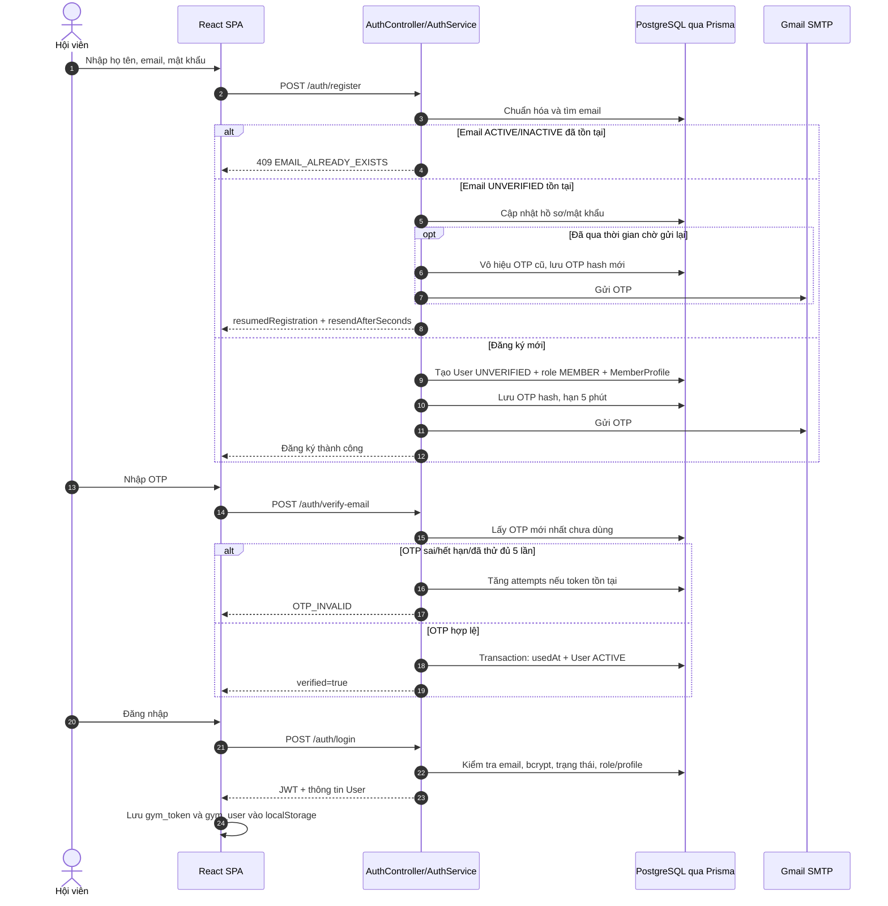
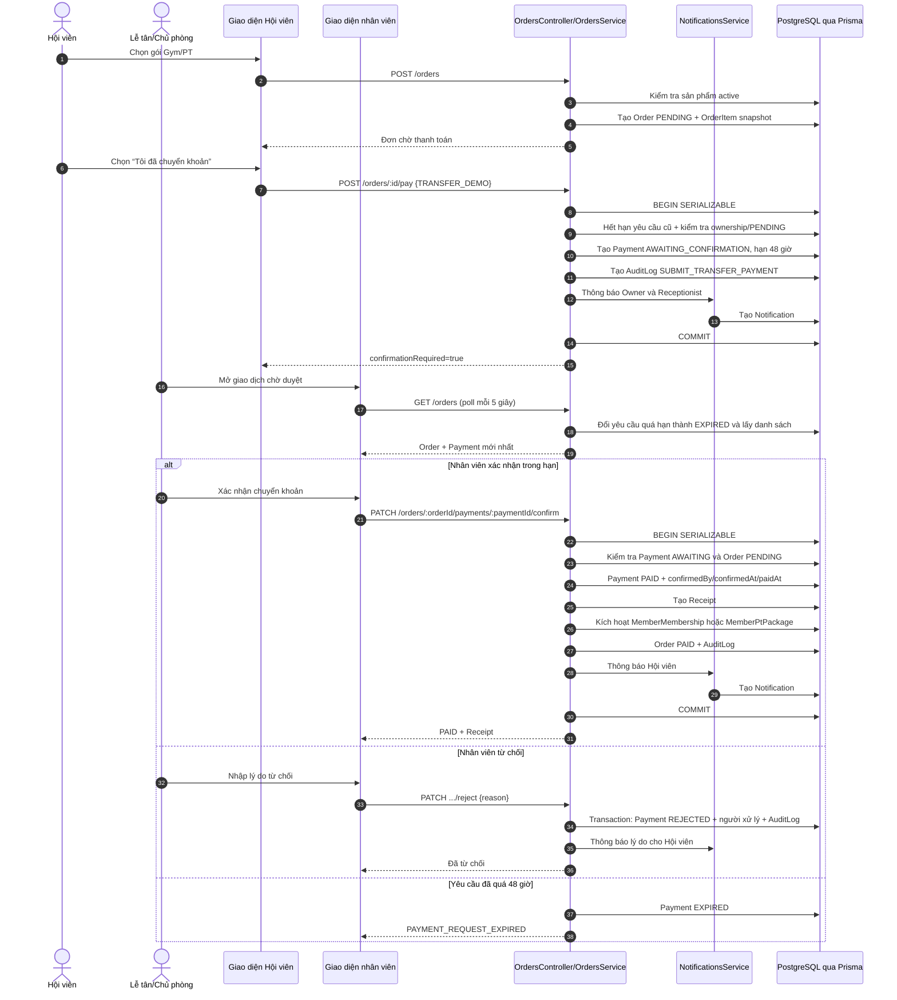
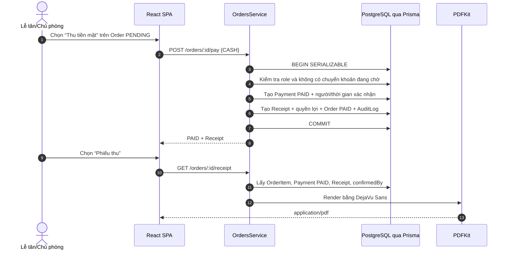
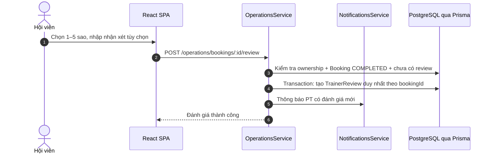

# Sequence Diagram

Các sơ đồ dưới đây bám theo endpoint và transaction hiện có trong Backend. `FE` là React SPA; các participant `*Service` thuộc cùng một NestJS modular monolith.

## 1. Đăng ký, OTP và đăng nhập



## 2. Mua gói bằng chuyển khoản mô phỏng



Chỉ nhánh xác nhận thành công mới tạo quyền lợi và phiếu thu. Sau khi bị từ chối hoặc hết hạn, Order vẫn `PENDING` nên Hội viên có thể gửi yêu cầu chuyển khoản mới.

## 3. Thu tiền mặt tại quầy và xuất phiếu thu



PDF ghi người xác nhận, vai trò, email tài khoản xác nhận, phương thức và thời gian xác nhận. Luồng tải lại phiếu thu không tạo thêm Payment hoặc Receipt.

## 4. Đặt và xử lý lịch PT

```mermaid
sequenceDiagram
  autonumber
  actor M as Hội viên
  actor T as PT/Chủ phòng
  participant FE as React SPA
  participant Ops as OperationsService
  participant Notify as NotificationsService
  participant DB as PostgreSQL qua Prisma

  M->>FE: Lọc ngày, sắp xếp lịch sớm/đánh giá/lượt đánh giá
  FE->>Ops: GET /operations/slots?from&to&sort
  Ops->>DB: Lấy slot tương lai/open kèm booking active
  Ops->>DB: Group review theo Trainer
  Ops-->>FE: Slot + booking + rating average/count
  FE->>FE: Với Member, chỉ hiển thị slot chưa có booking active

  M->>FE: Chọn slot và gói PT
  FE->>Ops: POST /operations/bookings
  Ops->>DB: BEGIN SERIALIZABLE
  Ops->>DB: Kiểm tra slot, trùng giờ và buổi khả dụng
  Ops->>DB: Tạo Booking PENDING + holdKey=slotId
  Ops->>DB: sessionsReserved += 1
  Ops->>Notify: Thông báo PT
  Ops->>DB: COMMIT
  Ops-->>FE: Booking PENDING

  alt PT xác nhận
    T->>FE: Chọn Xác nhận
    FE->>Ops: PATCH /bookings/:id/status {CONFIRMED}
    Ops->>DB: Booking CONFIRMED + resolvedBy/resolvedAt
    Ops->>Notify: Thông báo Hội viên
    alt Sau giờ bắt đầu: hoàn thành
      T->>FE: Chọn Hoàn thành
      FE->>Ops: PATCH ... {COMPLETED}
      Ops->>DB: BEGIN SERIALIZABLE
      Ops->>DB: sessionsReserved -= 1; sessionsUsed += 1
      Ops->>DB: Booking COMPLETED; holdKey=null; AuditLog
      Ops->>Notify: Mời Hội viên đánh giá
      Ops->>DB: COMMIT
    else Sau giờ kết thúc: vắng mặt
      T->>FE: Chọn Vắng mặt
      FE->>Ops: PATCH ... {NO_SHOW, reason?}
      Ops->>DB: Transaction: chuyển reserved thành used, giải phóng holdKey
      Ops->>Notify: Báo Hội viên đã trừ một buổi
    end
  else PT từ chối có lý do
    T->>FE: Chọn Từ chối
    FE->>Ops: PATCH ... {REJECTED, reason}
    Ops->>DB: Transaction: sessionsReserved -= 1; holdKey=null; AuditLog
    Ops->>Notify: Thông báo Hội viên
  else Người có quyền hủy trước giờ tập
    M->>FE: Hủy lịch
    FE->>Ops: PATCH ... {CANCELLED}
    Ops->>DB: Kiểm tra cutoff 4 giờ nếu Member hủy lịch CONFIRMED
    Ops->>DB: Transaction: hoàn reserved, giải phóng holdKey, AuditLog
    Ops->>Notify: Thông báo bên còn lại
  end
```

Booking `PENDING` đã giữ một buổi và giữ độc quyền slot. `COMPLETED` và `NO_SHOW` đều tiêu thụ buổi; `REJECTED` và `CANCELLED` hoàn buổi đang giữ.

## 5. Đánh giá PT sau buổi hoàn thành



## 6. Check-in bằng QR

```mermaid
sequenceDiagram
  autonumber
  actor M as Hội viên
  actor S as Lễ tân/Chủ phòng
  participant MFE as Giao diện Hội viên
  participant SFE as Giao diện quầy
  participant Camera as Camera + QR Scanner
  participant Ops as OperationsService
  participant DB as PostgreSQL qua Prisma

  M->>MFE: Mở QR cá nhân
  MFE-->>S: Hiển thị memberCode trong QR
  S->>SFE: Mở camera và cấp quyền
  SFE->>Camera: Đọc QR tại trình duyệt
  Camera-->>SFE: memberCode
  SFE->>Ops: GET /operations/checkins/eligibility/:memberCode
  Ops->>DB: Kiểm tra tài khoản ACTIVE và gói Gym hiệu lực
  Ops-->>SFE: Hội viên + danh sách gói + gói đề xuất

  S->>SFE: Chọn gói và xác nhận
  SFE->>SFE: Tạo crypto.randomUUID()
  SFE->>Ops: POST /operations/checkins
  Ops->>DB: Kiểm tra idempotencyKey
  Ops->>DB: Tìm check-in của Hội viên trong ngày Asia/Ho_Chi_Minh
  alt Đã check-in hôm nay
    Ops-->>SFE: 409 CHECKIN_ALREADY_TODAY
    Note over S,SFE: Lễ tân có thể cho Hội viên vào; không ghi thêm lượt
  else Chưa check-in
    Ops->>DB: BEGIN SERIALIZABLE
    Ops->>DB: Kiểm tra lại gói được chọn
    Ops->>DB: Tạo Checkin + recordedById + memberMembershipId
    opt Gói Gym theo lượt
      Ops->>DB: visitsUsed += 1
    end
    Ops->>DB: COMMIT
    Ops-->>SFE: Check-in thành công
  end
```

Member không tự ghi nhận check-in. Camera chỉ hỗ trợ đọc mã; nếu camera không dùng được, nhân viên nhập `memberCode` thủ công và phần API phía sau không thay đổi.
