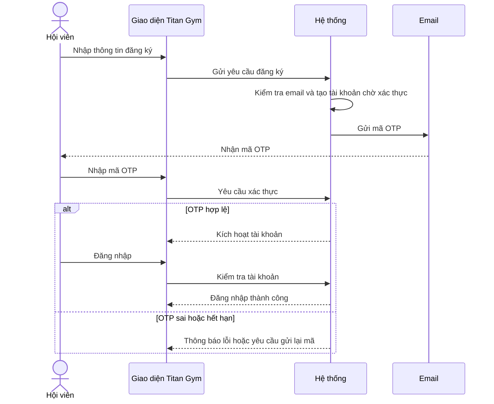
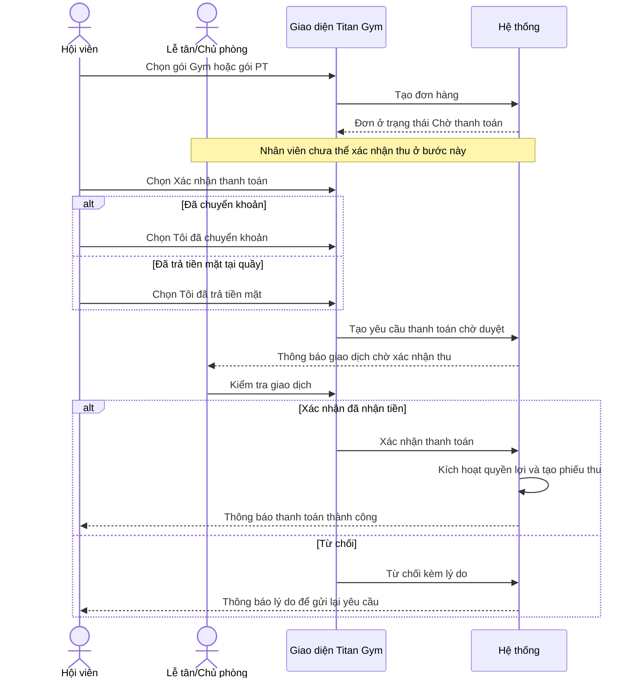
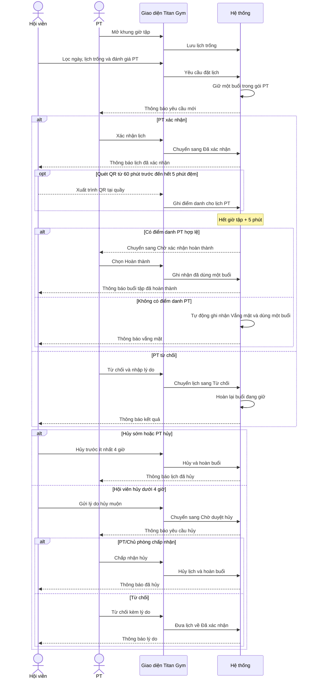
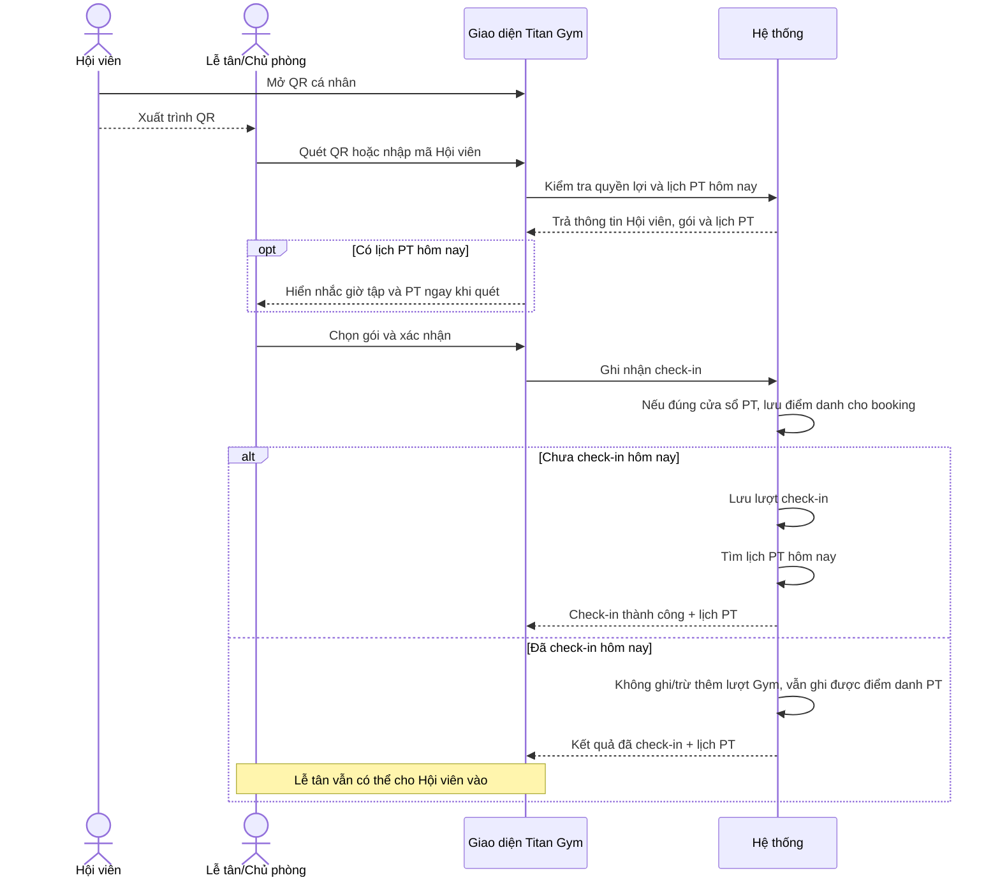
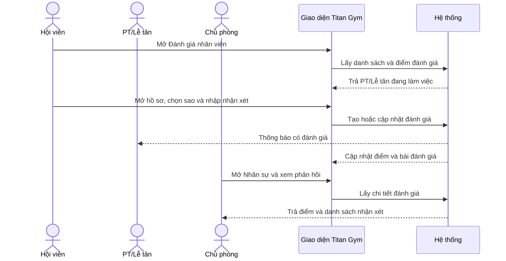

# Sequence Diagram

Các sơ đồ mô tả những quy trình nghiệp vụ chính của Titan Gym. Chi tiết API, cơ sở dữ liệu và cách triển khai được lược bỏ để sơ đồ dễ đọc.

## 1. Đăng ký và xác thực tài khoản

## 2. Mua gói và xác nhận thanh toán

Mọi phương thức đều phải do Hội viên xác nhận trước và chờ duyệt tối đa 48 giờ. Phiếu thu ghi rõ phương thức, thời gian và tài khoản Lễ tân/Chủ phòng đã xác nhận.

## 3. Đặt và xử lý lịch PT

Lịch `PENDING`, `CONFIRMED`, `CANCEL_REQUESTED` hoặc `AWAITING_COMPLETION` giữ một buổi. `COMPLETED` và `NO_SHOW` dùng một buổi; `REJECTED` và `CANCELLED` hoàn lại buổi.
Chủ phòng có thể hỗ trợ xử lý lịch, nhưng chỉ PT mở khung giờ của chính mình.

## 4. Check-in bằng QR

Hội viên chỉ hiển thị QR; quyền xác nhận tại quầy thuộc Lễ tân hoặc Chủ phòng. Lượt Gym vẫn tối đa một lần/ngày, còn điểm danh PT được lưu riêng khi quét từ 60 phút trước giờ bắt đầu đến 5 phút sau giờ kết thúc.

## 5. Đánh giá nhân viên

Mỗi Hội viên có một bài trên mỗi nhân viên và có thể cập nhật; không yêu cầu từng đặt lịch PT với người được đánh giá.
